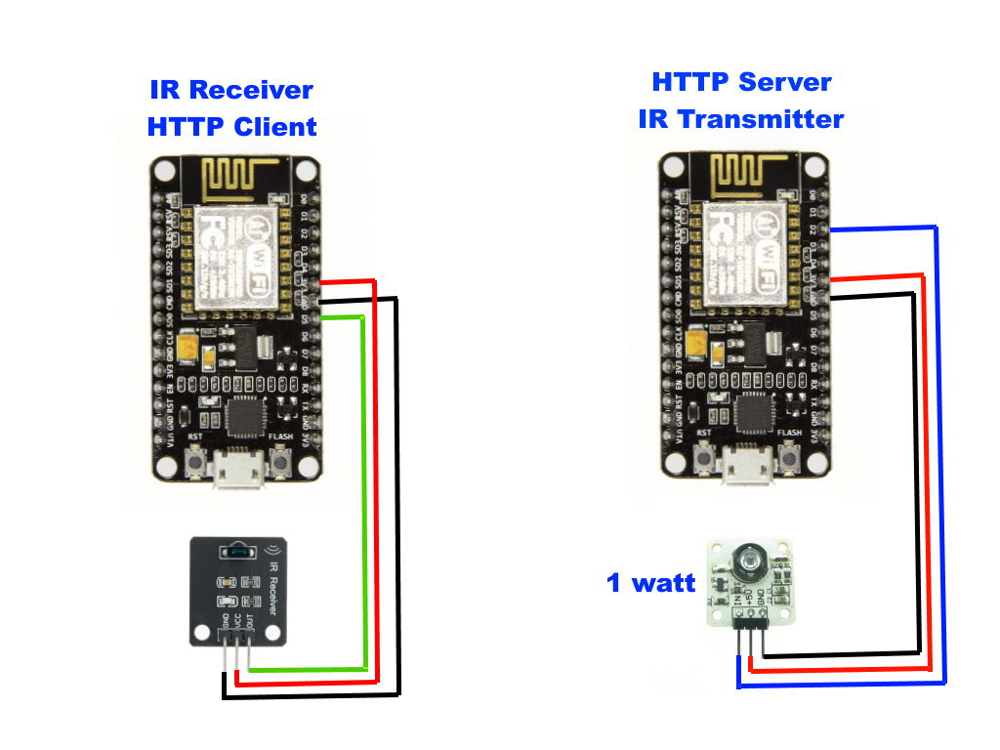
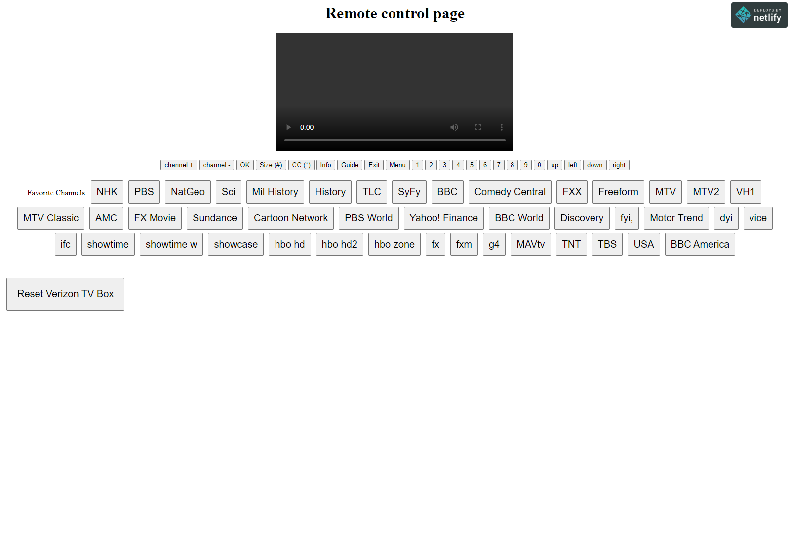
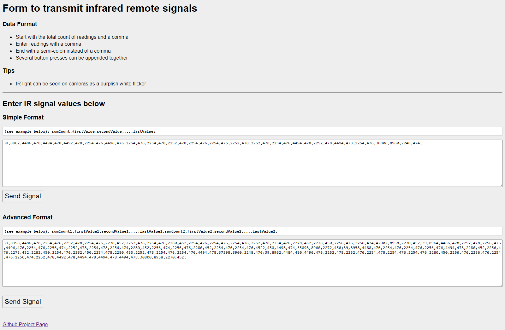

# esp8266InfraredRemoteRepeater

Repeat an infrared (IR) remote signal over WiFi on your LAN or over the Internet.  The signal gets sent over HTTP as a form POST request.  An HTTP server receives the IR signal as plain-text and re-transmits it to your device.  

For example, press a button on your remote in one room and have it change the channel in another room.  Access your TV set-box over the Internet so you can remotely change the channel using your phone or laptop.

You can make a web page that can be used to submit the HTTP form without the remote.  Send the signals from any web page on your computer, phone, etc.

Modules used:
* Infrared LED 1W 350mA Transmitter Module (Sourcekit 161002922)
  * Sold on Ebay and Aliexpress: "1w infrared module"
* IR Receiver Module (YwRobot 545754)
  * Sold on Ebay and Aliexpress usually in pairs, query: "IR Receiver Module"
* 2x ESP8266 NodeMCU Microcontrollers
* 6x female-female dupont jumper wires
* 1x 1 channel relay module (optional)

<kbd></kbd>

<kbd></kbd>

<kbd></kbd>
